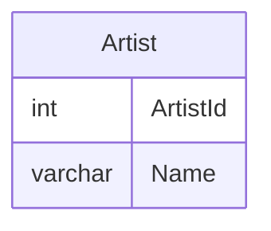
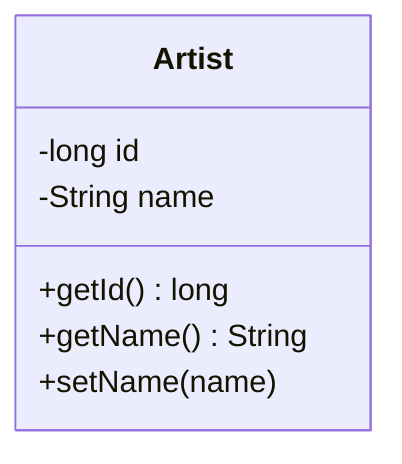

# intro-jdbc

> Vi ansluter till MySQl och Chinook databasen och gör en enkel ORM (Object Relational Mapping).

> Koden innehåller två "mönster", felhantering och läsning från databas. Därför är den svårläst.

## Instruktioner

### Preparera databas

```bash
curl -L https://gist.github.com/miwashiab/e39a3228f0b389b6f3eca1b8c613bb2e/raw/db.sql -o db.sql
docker start iths-mysql
docker exec -i iths-mysql mysql -uroot -proot < db.sql
docker exec -i iths-mysql mysql -uroot -proot  <<< "GRANT INSERT, SELECT, UPDATE, DELETE ON Chinook.* to 'iths'@'%';"
```

### E-R Diagram



### Klass diagram



### App.java

```bash
vi ./app/src/test/java/se/iths/App.java
```

```java
public class App {

  private static final Collection<Artist> artists = new ArrayList<>();
  private static final String JDBC_CONNECTION = "jdbc:mysql://localhost:3306/Chinook";
  private static final String JDBC_USER = "iths";
  private static final String JDBC_PASSWORD = "iths";
  private static final String SQL_SELECT_ALL_ARTISTS = "SELECT ArtistId, Name FROM Artist";
  private static final String SQL_COL_ARTIS_ID = "ArtistId";
  private static final String SQL_COL_ARTIS_NAME = "name";
  
  public static void main(String[] args) throws Exception {
    Connection con = con = DriverManager.getConnection(JDBC_CONNECTION, JDBC_USER, JDBC_PASSWORD);
    ResultSet rs = con.createStatement().executeQuery(SQL_SELECT_ALL_ARTISTS);
    while(rs.next()){
      long id = rs.getLong(SQL_COL_ARTIS_ID);
      String name = rs.getString(SQL_COL_ARTIS_NAME);
      artists.add(new Artist(id, name));
    }
    rs.close(); //Måste ALLTID stängas för att hjälpa garbage collection!
    con.close(); //Måste ALLTID stängas för att hjälpa garbage collection!

    for(Artist artist: artists){
      System.out.println(artist);
    }
  }
}
```

### felhantering

```java
{
    //Deklarera all variabler som ska vara synliga överallt;
    Connection con = null;
    
    try{// Huvudflöde
        
        
    } catch(SQLException e){ // Undantagsflöde
        
    } finally { // Kod som måste köra oavsett om huvudflöde eller Undantagsflöde körs.
        try { // Vi är osäkra på tillstånd, så vi måste köra kod och dölja fel.
        } catch(Exception ignore){}//Går det fel här ignorerar vi det. (Kanske bra att logga fel)
    }
}
```

### App.java + felhantering

```java
public class App {

  private static final Collection<Artist> artists = new ArrayList<>();
  private static final String JDBC_CONNECTION = "jdbc:mysql://localhost:3306/Chinook";
  private static final String JDBC_USER = "iths";
  private static final String JDBC_PASSWORD = "iths";
  private static final String SQL_SELECT_ALL_ARTISTS = "SELECT ArtistId, Name FROM Artist";
  private static final String SQL_COL_ARTIS_ID = "ArtistId";
  private static final String SQL_COL_ARTIS_NAME = "name";
  public static void main(String[] args)  {
    Connection con = null;
    ResultSet rs = null;
    try {
      con = con = DriverManager.getConnection(JDBC_CONNECTION, JDBC_USER, JDBC_PASSWORD);
      rs = con.createStatement().executeQuery(SQL_SELECT_ALL_ARTISTS);
      while(rs.next()){
        long id = rs.getLong(SQL_COL_ARTIS_ID);
        String name = rs.getString(SQL_COL_ARTIS_NAME);
        artists.add(new Artist(id, name));
      }
    } catch (SQLException e) {
       System.err.println(String.format("Fel vid läsning av databas %s", e.toString()));
    } finally {
      try {
        rs.close();
      }catch (Exception ignore){}
      try {
        con.close();
      }catch (Exception ignore){}
    }

    for(Artist artist: artists){
      System.out.println(artist);
    }
  }

}
```

### Artist.java

```java
public class Artist {
    private final long id;
    private String name;

    public Artist(long id, String name){
        this.id = id;
        this.name = name;
    }

    public long getId() {
        return id;
    }

    public String getName() {
        return name;
    }

    public void setName(String name) {
        this.name = name;
    }

    public String toString(){
        return String.format("%d %s", id, name);
    }
}
```
