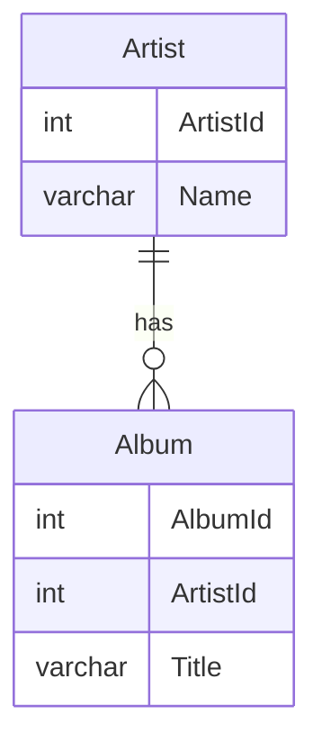
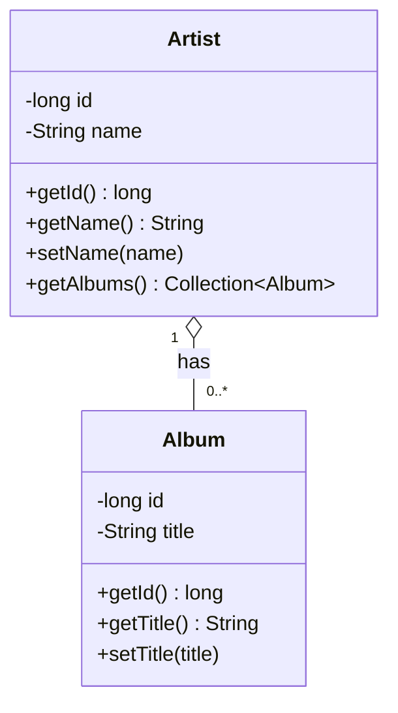

# intro-jdbc


> Vi ansluter till MySQL och Chinook databasen och gör en lite komplexare ORM (Object Relational Mapping).
> Felhanteringen är lite enklare, för vi avslutar progammet vid första fel som uppstår.

> Observera att package se.iths; saknas och imports saknas.

## Instruktioner

### E-R Diagram



### Klass diagram



### App.java

```java
public class App {

  private static final String JDBC_CONNECTION = "jdbc:mysql://localhost:3306/Chinook";
  private static final String JDBC_USER = "iths";
  private static final String JDBC_PASSWORD = "iths";
  private static final String SQL_SELECT_ALL_ARTISTS = "SELECT ArtistId, Name FROM Artist";
  private static final String SQL_SELECT_ALBUM_FOR_ARTISTS = "SELECT AlbumId, Title FROM Album WHERE ArtistId = ?";
  private static final String SQL_COL_ARTIST_ID = "ArtistId";
  private static final String SQL_COL_ARTIST_NAME = "Name";
  private static final String SQL_COL_ALBUM_ID = "AlbumId";
  private static final String SQL_COL_ALBUM_TITLE = "Title";
  
  public static void main(String[] args)  {
    App app = new App();
    try {
      app.load();
    } catch (SQLException e) {
      System.err.println(String.format("Något gick fel vid inläsning av databas! (%s)", e.toString()));
    }
  }

  private void load() throws SQLException {
    Collection<Artist> artists = loadArtists();
    for(Artist artist: artists){
      System.out.println(artist);
    }
  }
  
  private Collection<Artist>  loadArtists() throws SQLException {
    Collection<Artist> artists = new ArrayList<>();
    Connection con = con = DriverManager.getConnection(JDBC_CONNECTION, JDBC_USER, JDBC_PASSWORD);
    ResultSet rs = con.createStatement().executeQuery(SQL_SELECT_ALL_ARTISTS);
    while(rs.next()){
      long id = rs.getLong(SQL_COL_ARTIST_ID);
      String name = rs.getString(SQL_COL_ARTIST_NAME);
      Artist artist = new Artist(id, name);
      artists.add(artist);
      Collection<Album> albums = loadAlbums(artist.getId());
      for(Album album : albums) {
        artist.add(album);
      }
    }
    rs.close();
    con.close();
    return artists;
  }

  private Collection<Album> loadAlbums(long artistId) throws  SQLException{
    Connection con = con = DriverManager.getConnection(JDBC_CONNECTION, JDBC_USER, JDBC_PASSWORD);
    Collection<Album> albums = new ArrayList<>();

    PreparedStatement stmt = con.prepareStatement(SQL_SELECT_ALBUM_FOR_ARTISTS);
    stmt.setLong(1, artistId);//Sätt värde för första frågetecknet
    ResultSet rs = stmt.executeQuery();
    while(rs.next()){
      long id = rs.getLong(SQL_COL_ALBUM_ID);
      String title = rs.getString(SQL_COL_ALBUM_TITLE);
      Album album = new Album(id, title);
      albums.add(album);
    }
    stmt.close();
    rs.close();
    con.close();
    return albums;
  }
}
```

### Artist.java

```java
public class Artist {
    private final long id;
    private String name;
    private Collection<Album> albums = new ArrayList<>();

    public Artist(long id, String name){
        this.id = id;
        this.name = name;
    }

    public long getId() {
        return id;
    }

    public String getName() {
        return name;
    }

    public void setName(String name) {
        this.name = name;
    }

    public void add(Album album){
        albums.add(album);
    }

    public String toString(){
        StringBuilder builder = new StringBuilder(String.valueOf(id));
        builder.append(": ");
        builder.append(name);
        builder.append("\nAlbums:\n");
        for(Album album : albums){
            builder.append("\t");
            builder.append(album);
            builder.append("\n");
        }
        return builder.toString();
    }
}
```

### Album.java

```java
public class Album {
    private final long id;
    private String title;

    public Album(long id, String title){
        this.id = id;
        this.title = title;
    }

    public long getId() {
        return id;
    }

    public String getTitle() {
        return title;
    }

    public void setTitle(String title) {
        this.title = title;
    }

    public String toString() {
        return String.format("%d %s", id, title);
    }
}
```
